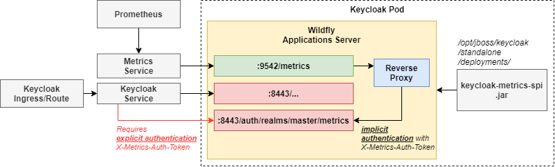

<!--
SPDX-FileCopyrightText: 2025 Deutsche Telekom AG

SPDX-License-Identifier: CC0-1.0    
-->

# Iris Keycloak Image (IKI)

## About

This project is used for setUp docker image, which will be used as a preconfigured Keycloak to run it as the
identity provider with custom extensions. This _IKI_ comes with selected
[extensions](https://www.keycloak.org/extensions.html) (here with a prometheus metrics exporter).

## Original Keycloak Image

Use original Keycloak image from quay.io/keycloak/ or mirror it if needed
to your specific repository and provide its destination inside the Dockerfile. In this version the Keycloak image with
tag **26.0.8** is used.

## Chart

It's intended to be used with the Helm chart provided in the [gitHub repo](https://github.com/telekom/iris-charts)

## Extensions

### keycloak-metrics-spi

There are the metrics extension used [keycloak-metrics-spi](https://github.com/aerogear/keycloak-metrics-spi).
The extension has not been modified and is used as is.

When you deploy Keycloak using this image, a new REST endpoint is made
available: `https://my-keycloak-instance/auth/realms/master/metrics`.  
From this endpoint you will be able to access all metrics from all(!) realms no matter what realm is in the URL.

(!) This path is not password-protected. To prevent unauthorized access to the metrics the chart blocks the path by
using ha-proxy

To provide the metrics to the monitoring infrastructure HAProxy forwards requests from :9542/metrics to Keycloak
metrics. You can see how [HAProxy](https://github.com/telekom/iris-charts) configured
under _templates/configmap-haproxy.yaml_ directory.



## Local development

### Run Keycloak

To run an on-the-fly development Keycloak on your local machine, follow these
steps: [original documentation](https://www.keycloak.org/getting-started/getting-started-zip)

1. Download Keycloak server binaries here: https://www.keycloak.org/downloads
2. Unzip to desired location
3. Run development mode with `kc.sh start-dev` or `kc.bat start-dev`
4. Set up a realm. You may also add an identity provider redirecting to the master
   realm.

## Reset local settings

Delete the `h2` directory in your `keycloak/data` directory.

## Build

### Local

You can build the Keycloak image locally using a **multi-stage Docker build**, which builds the extensions and creates the final image in one step — no manual steps or copying needed.

This build process includes:
- Building all custom **Keycloak extensions**, such as `keycloak-metrics-spi` and `client-auth-method-spi`
- Packaging the compiled extensions directly into the final Keycloak image

To run the build:

```bash
docker build --build-arg=BASE_IMAGE_TAG=${KEYCLOAK_VERSION} -t iris .
```

💡 You can add` --platform=linux/amd64` flag if you're building on a non-amd64 machine. On most systems, it's safe to omit it.

## Code of Conduct

This project has adopted the [Contributor Covenant](https://www.contributor-covenant.org/) in version 2.1 as our code of conduct. Please see the details in our [CODE_OF_CONDUCT.md](CODE_OF_CONDUCT.md). All contributors must abide by the code of conduct.

By participating in this project, you agree to abide by its [Code of Conduct](./CODE_OF_CONDUCT.md) at all times.

## Licensing

This project follows the [REUSE standard for software licensing](https://reuse.software/).
Each file contains copyright and license information, and license texts can be found in the [./LICENSES](./LICENSES) folder. For more information visit https://reuse.software/.

### REUSE

The [reuse tool](https://github.com/fsfe/reuse-tool) can be used to verify and establish compliance when new files are added. 

For more information on the reuse tool visit https://github.com/fsfe/reuse-tool.

**Check for incompliant files (= not properly licensed)**

Run `pipx run reuse lint`

**Get an SPDX file with all licensing information for this project (not for dependencies!)**

Run `pipx run reuse spdx`

**Add licensing and copyright statements to a new file**

Run `pipx run reuse annotate -c="<COPYRIGHT>" -l="<LICENSE-SPDX-IDENTIFIER>" <file>`

Replace `<COPYRIGHT>` with the copyright holder, e.g "Deutsche Telekom AG", and `<LICENSE-SPDX-IDENTIFIER>` with the ID of the license the file should be under. For possible IDs see https://spdx.org/licenses/.

**Add a new license text**

Run `pipx run reuse download --all` to add license texts for all licenses detected in the project.
