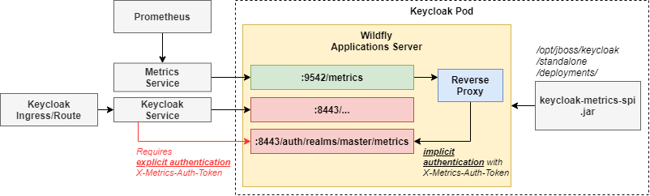
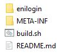

# Iris Docker Image

Target Repo https://mtr.devops.telekom.de/repository/tardis-internal/io/iris

## Original Keycloak Image
Mirror of original Keycloak image from quay.io/keycloak/ to https://mtr.devops.telekom.de/repository/tardis-common/keycloak.
For the mirroring Process we use: 
- specify version in template https://gitlab.devops.telekom.de/dhei/teams/io/templates/gitlab-pipelines/-/blob/develop/docker/gitlab-ci.docker.yml#L502
- start Job manual to mirror the image https://gitlab.devops.telekom.de/dhei/teams/io/tools/image-migrator/-/blob/main/.gitlab-ci.yml#L63

## Chart 
Iris image provided by DHEI and based on Keycloak, which comes with selected extensions like a prometheus metrics exporter.  
This image is intended to be used only with the Iris Helm chart provided by DHEI: [/io/products/iris/iris-chart/](https://gitlab.devops.telekom.de/dhei/teams/io/products/iris/iris-chart)

## Extensions

### keycloak-metrics-spi

We use the metrics extension from [here](https://github.com/aerogear/keycloak-metrics-spi)

When you deploy Keycloak using this image, a new REST endpoint is made available:  ``https://my-keycloak-instance/auth/realms/master/metrics``.  
From this endpoint you will be able to access all metrics from all(!) realms no matter what realm is in the URL.

After deploying the Iris Helm chart this path won't be available because it isn't secured by a password and therefore blocked by ha-proxy. 
(!) This path is not password-protected. To prevent unauthorized access to the metrics the chart blocks the path by using ha-proxy

To provide the metrics to the monitoring infrastructure ha-proxy forwards requests from :9542/metrics to Keycloaks metrics.

[ha-proxy config](https://gitlab.devops.telekom.de/dhei/teams/io/products/iris/iris-chart/-/blob/develop/templates/configmap-haproxy.yaml)
 
 

 # Local development

 ## Run Keycloak

To run an on-the-fly development keycloak on your local machine, follow these steps: [original documentation](https://www.keycloak.org/getting-started/getting-started-zip)
1. Download Keycloak server binaries here: https://www.keycloak.org/downloads
2. Unzip to desired location
3. Copy ```enilogin``` theme and ```META-INF``` directory from Iris-Image repo to the unzipped Keycloak/themes.



4. Run development mode with ```kc.sh start-dev``` or ```kc.bat start-dev```
5. Setup a realm using ENI-Login theme. You may also add an identity provider redirecting to the master realm.

## Testing eni-login

1. Create a new realm ```eni-login```
2. Add ```enilogin``` and enable ```Client authentication```
3. Configure eni-login realm and set eni-login as theme in ```Realm settings > Themes > Login theme: enilogin```
4.Add master realm as identity provider to eni-login realm as ```Keycloak OpenID Connect```
5. Disable auto discovery and add the following URLs:\
   **Authorization URL**: ```http://localhost:8080/auth/realms/master/protocol/openid-connect/auth``` \
   **Token URL:** ```http://localhost:8080/auth/realms/master/protocol/openid-connect/token```
6. Add \
   **Client ID:** ```enilogin```
   **Client Secret:** ```enilogin-secret``` (from master realm)
7. Open [http://localhost:8080/realms/enilogin/account/](http://localhost:8080/realms/enilogin/account/) and click on ```Sign in``` \
   You should see ```keycloak-oidc``` as a selectable identity provider.

## Publish

When you're finished making changes, copy the edited files back to the repository. Final builds will be done by ```build.sh``` run by the ```build:extensions``` job in the pipeline.

## Reset local settings

Delete the ```h2``` directory in yourour ```keycloak/data``` directory.
